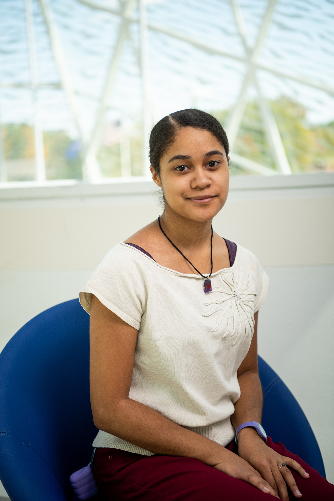

# WSP-myProject
My personal project for Web Server Programming
# About Me

My name is Imani Taylor. I am a junior at New Paltz studying Computer Science. I actually just transferred here last semester from Rensselaer Polytechnic Institute (RPI). At RPI, I majored in Computer and Systems Engineering and switched to Information Technology and Web Science during my last semester there. Prior to that, I first got my start in programming in high school through a summer program called Girls Who Code, where I learned Scratch, Python, Java, HTML, and CSS. Between RPI and New Paltz, I have taken the following computer-related courses: Computer Science 1, Data Structures, Intro to ECSE, Foundations of Computer Science, Computer Components and Operations, Embedded Control, Intro to ITWS, Web Systems Development, Object Oriented Programming, and Assembly Language and Computer Architecture. In Intro to ITWS, I worked with a group to develop a web application that allows professors to better keep track of attendance for various classes using time sensitive electronic codes as opposed to calling out names or having students sign or check next to their names on paper. In Web Systems Development, I worked with a group to create a website where users can go and create and/or answer survey questions on virtually any topic as long as they are approved by an admin. 

After college, I want to use my computer skills to help some kind of non-profit or organization that really makes a positive impact on its community or the world as a whole. This means that I will likely end up in web development depending on the type of company I find. Non-profit or not, every company needs a functional, engaging, and secure website, and so much information is stored on the internet these days; thus that is one of the career paths I am considering. Additionally, I have a couple websites of my own that I would like to get up and running as soon as I can, and just haven’t had the time (being a full-time student) to develop my skills to do so. I am excited to use this class as an opportunity to practice what I know and learn what I don’t. 
